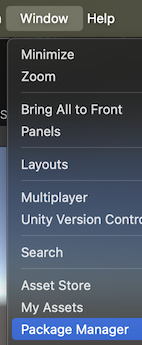
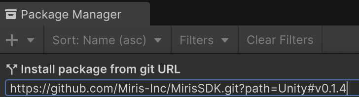
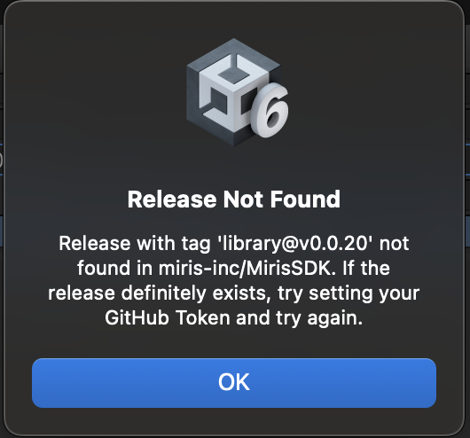
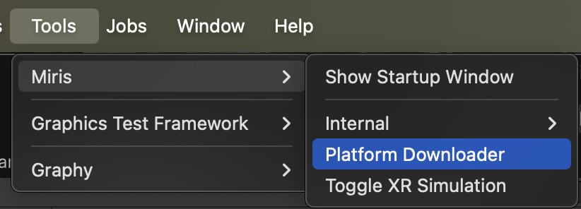
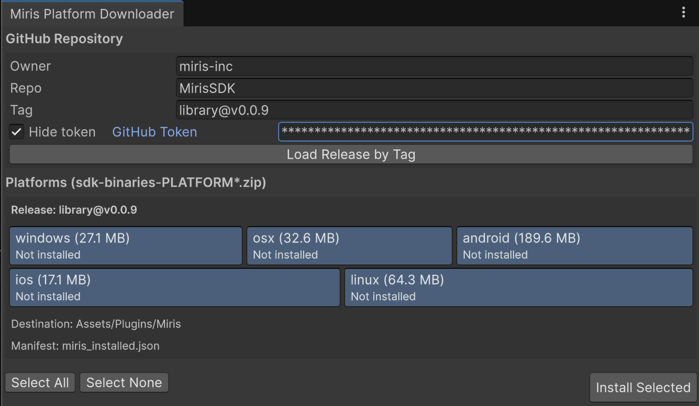
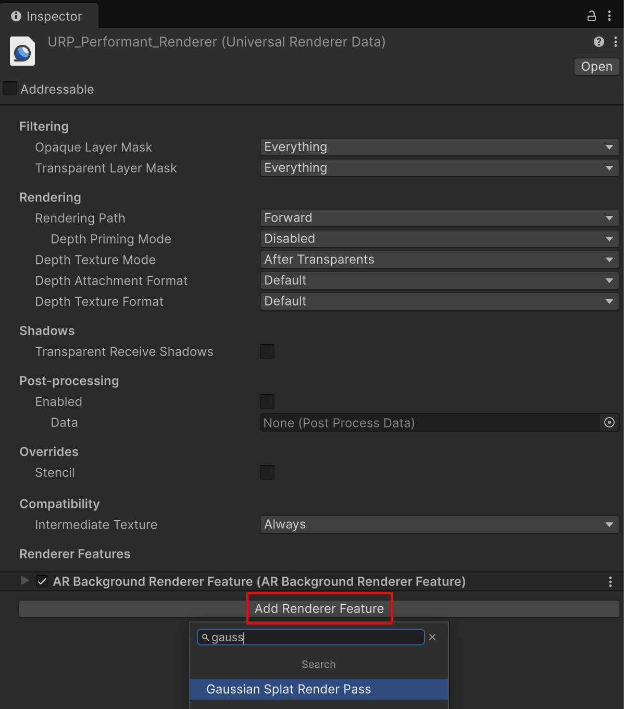
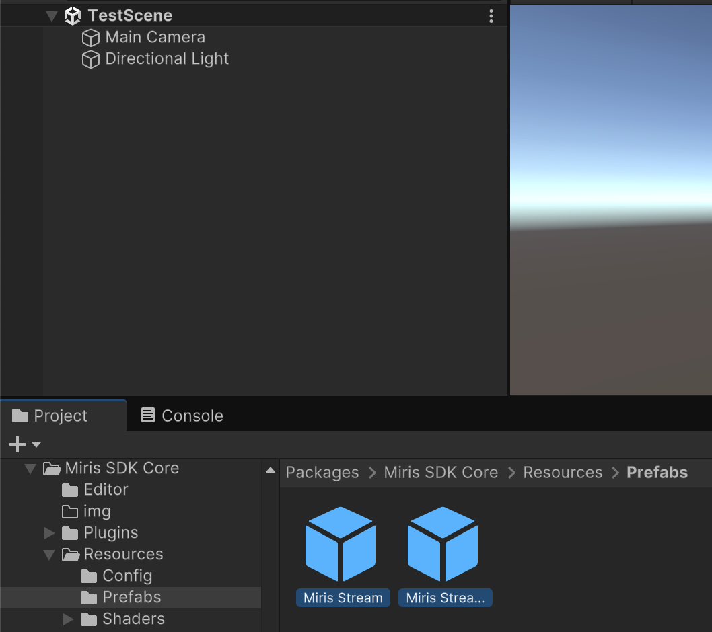
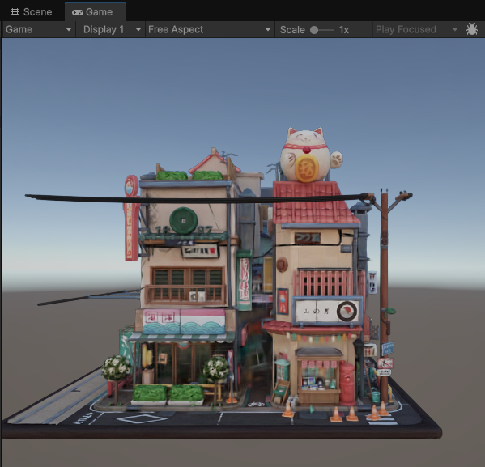

<!--MDX_STRIP-->
<!--Do not remove the MDX_STRIP comments - they are used for our Documentation publishing process-->
# Miris Unity Integration

Welcome to the Miris Unity Integration for spatial streaming.

## Requirements

<!--END_MDX_STRIP-->
Your Unity project must be using Unity 6000.0.58f2 or newer.

For desktop hosts, the system requirements are below:

| OS      | Requirements                                                 |
| ------- | ------------------------------------------------------------ |
| Windows | Windows 11                                                   |
| Linux   | Ubuntu 22.04 LTS<br/>Support for other flavors of Linux, and other versions of Ubuntu, are not guaranteed |
| macOS   | macOS 15.0                                                   |

For deployments targeting specific devices, the minimum system requirements are below:

| Device     | Requirements                                           |
| ---------- | ------------------------------------------------------ |
| Android    | API level 32<br />Only arm64-v8a devices are supported |
| iOS/iPadOS | iOS/iPadOS 18.2                                        |
| Meta Quest | Only the Meta Quest 3 and Meta Quest 3S are supported  |

## Installation

1. Make sure [git](https://git-scm.com/) is installed on your device.

2. Since we are currently using a private repo for this package, you will need to download and set up the [Git Credential Manager](https://docs.unity3d.com/6000.2/Documentation/Manual/upm-config-https-git.html).

   * Once installed, open a terminal and set the working directory to the target repo.  Then run the following commands:
   ```
   git config --global credential.helper manager
   git ls-remote --heads https://github.com/Miris-Inc/MirisSDK HEAD
   ```

3. Open a Unity Project and use the Package Manager to install the Miris SDK. **Please ensure that you are not in Play mode before proceeding with the following steps.**

    * Navigate to Window -> Package Manager
    
    * Use the "+" button to `Install git package from url...`
    
    * Paste the following into the git URL field to download the latest SDK, then click the install button: `https://github.com/Miris-Inc/MirisSDK.git?path=Unity#latest`
    

4. The Miris SDK will need to install the native libraries it uses into the `Assets/Plugins/Miris` folder. If this folder does not contain platform folders with libraries inside, you will need to download them via the in editor tool. 

    * If the `Assets/Plugins/Miris` folder already contains the libraries, you can skip to step 6.
    
    * If the folder does _not_ contain the libraries, or you see a pop-up like the above, you must follow the below instructions in step 5.

5. Miris Platform Downloader Editor Tool
    * In the Unity Editor window, in the toolbar, select Tools -> Miris -> Platform Downloader
      

    * If you've been directed to download a specific release, change the Tag field. Otherwise, paste your token into the GitHub Token field, and then click Load Release by Tag.

    * All compatible releases should be selected for you. Click `Install Selected`.
      

6. Settings changes

    * If your project is on URP (Universal Render Pipeline), then you will need to add the Gaussian Splat Render Pass component.  If not, skip to step 7.

    * In your Assets folder, find the Settings folder. In there you will need to update the Renderer assets to add a component/render feature: `Gaussian Splat Render Pass`
    

    **Windows and Linux**: Our gaussian splat renderer requires certain shader intrinsics that may or may not be available with your project's Graphics API.  For the smoothest rendering experience, we recommend using the Vulkan API.

    * Go to `Edit` -> `Project Settings` -> `Player` -> `Other Settings` -> `Rendering`.
    * If `Auto Graphics API` for your platform is enabled, disable it.
    * Look for the `Graphics API` item. Ensure that `Vulkan` is the only entry present by using the `-` button to remove entries and the `+` button to add the `Vulkan` entry, if not already present.

7. Prefab setup

    * Drop the Miris Stream and `Miris Stream Controller` prefab into your scene.
    
    * On the `Miris Stream` prefab, enter the ID for the asset you want to stream. This ID will have been supplied to you by our asset upload service, and is of the form `aaaaaaaa-bbbb-cccc-dddd-eeeeeeeeeeee`.

8. Stream!

    * If everything is set up successfully, the streaming content will be visible in the editor window without being in play mode. 
    * You can also press play to start streaming.
    

<!--MDX_STRIP-->
### Notes

* Miris employees should consult the centralized documentation, rather than this document.
<!--END_MDX_STRIP-->
