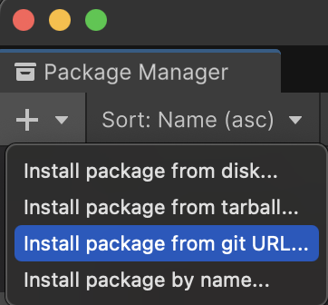
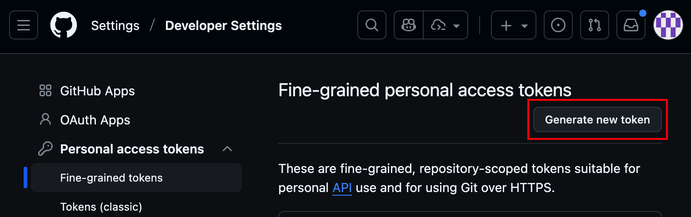
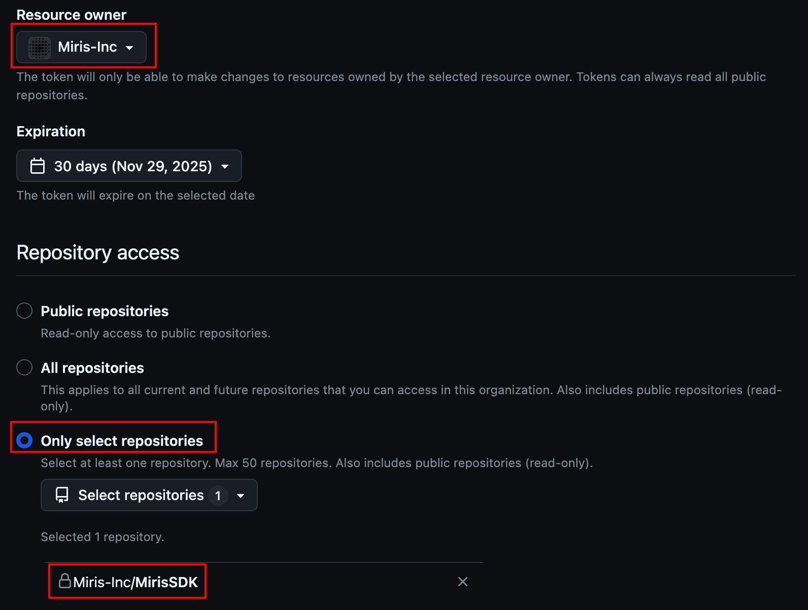
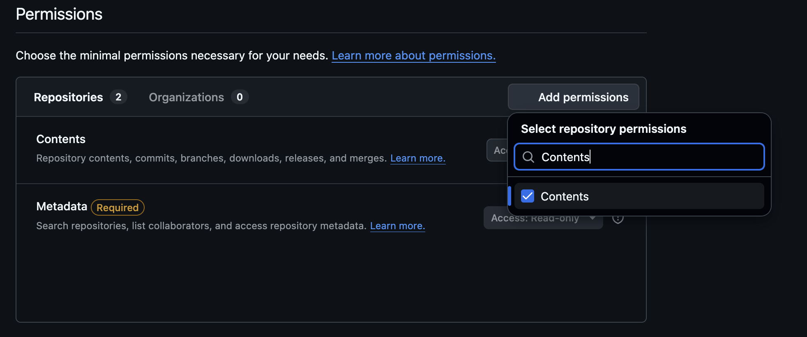

<!--MDX_STRIP-->
<!--Do not remove the MDX_STRIP comments - they are used for our Documentation publishing process-->
# Miris Unity Integration

Welcome to the Miris Unity Integration for spatial streaming.

## Requirements

<!--END_MDX_STRIP-->
Your Unity project must be using Unity 6000.0.58f2 or newer.

For desktop hosts, the system requirements are below:

| OS      | Requirements                                                 |
| ------- | ------------------------------------------------------------ |
| Windows | Windows 11                                                   |
| Linux   | Ubuntu 22.04 LTS Support for other flavors of Linux, and other versions of Ubuntu, are not guaranteed |
| macOS   | macOS 15.0                                                   |

For deployments targeting specific devices, the minimum system requirements are below:

| Device     | Requirements                                           |
| ---------- | ------------------------------------------------------ |
| Android    | API level 32 Only arm64-v8a devices are supported |
| iOS/iPadOS | iOS/iPadOS 18.2                                        |
| Meta Quest | Only the Meta Quest 3 and Meta Quest 3S are supported  |

## Installation

1. Make sure [git](https://git-scm.com/) and [git lfs](https://git-lfs.com/) are installed on your device.

2. Temporarily, since we are using a private repo for this package, you will need to download and set up the [Git Credential Manager](https://docs.unity3d.com/6000.2/Documentation/Manual/upm-config-https-git.html).

    * Once installed, go to the unity project repo you want to have this package in and run `git config --global credential.helper manager`
    * Followed by `git ls-remote --heads https://github.com/Miris-Inc/MirisSDK HEAD`

3. Open a Unity Project and use the Package Manager to install the Miris SDK. **Please ensure that you are not in Play mode before proceeding with the following steps.**

    * Navigate to Window -> Package Manager
    
    * Use the "+" button to `Install git package from url...`
    
    * Paste the following and hit install: `https://github.com/Miris-Inc/MirisSDK.git?path=Unity#v0.1.4`
    

4. Verify that the native libraries were downloaded. The Miris Unity Integration uses native libraries (such as DLLs) for performance reasons. When the Package Manager downloads the integration, it tries to download the native libraries, but you should verify before you begin development.

    * Check the `Assets/Plugins/Miris` folder in your project. If it is empty, you'll need to go through the following additional steps.

<!--MDX_ACCORDION="Downloading the Native Libraries"-->
5. Using a GitHub PAT to download the Native Libraries
    * We strongly recommend using a Fine-Grained token for this process. Visit https://github.com/settings/personal-access-tokens - and click "Generate New Token"
    

    * Set a reasonable token name and token expiration date. Set "Miris-Inc" as the Resource Owner. Select "Only select repositories", and then select "Miris-Inc/MirisSDK" in the dropdown.
    

    * Add permissions to this token. Select "Repositories", click "Add Permissions", and then select "Contents" from the dropdown.
    

    * Click "Generate Token". **Save this token in a secrets or password manager.**

    * Back in the Unity Editor window, in the toolbar, select Tools -> Miris -> Platform Downloader
    

    * If you've been directed to download a specific release, change the Tag field. Otherwise, paste your token into the GitHub Token field, and then click Load Release by Tag.

    * All compaitble releases should be selected for you. Click Install Selected.
    
<!--END_MDX_ACCORDION-->

6. Settings changes

    * If your project is on URP, you will need to add the Gaussian Splat Render Pass.

    * In your Assets folder, find the Settings folder. In there you will need to update the Renderer assets to add a component/render feature: `Gaussian Splat Render Pass`

    Our gaussian splat renderer requires certain shader intrinsics that may or may not be available with your project's Graphics API, especially on Windows and Linux. For the smoothest rendering experience, we recommend using the Vulkan API.

    * Go to `Edit` -> `Project Settings` -> `Player` -> `Other Settings` -> `Rendering`.
    * If `Auto Graphics API` for your platform is enabled, disable it.
    * Look for the `Graphics API` item. Ensure that `Vulkan` is the only entry present by using the `-` button to remove entries and the `+` button to add the `Vulkan` entry, if not already present.

7. Prefab setup

    * Drop the Miris Stream and `Miris Stream Controller` prefab into your scene.
    
    * Drag the controller prefab into the slot in the Stream prefab.
    * On the `Miris Stream` prefab, enter the url for an asset you want to stream. For example `https://devcontents3.miris.com/prod/tokyo/1x1/structure.usda`

8. Press play

    * This will start the streaming process and load the asset into your scene.

<!--MDX_STRIP-->
### Notes

* **Currently investigating solutions to issues running aqua-dlls/libs built on another machine. The first versions of this SDK might not run properly on your machine due to this and potential OS security blockings.**
* This sdk has not been fully tested and is being posted mostly for format purposes in this version.
* Miris employees should consult the centralized documentation, rather than this document.
<!--END_MDX_STRIP-->
