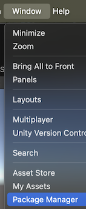
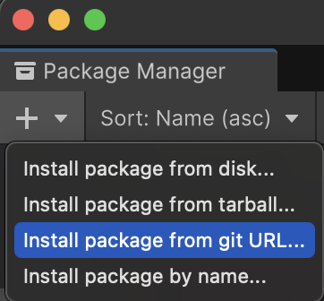
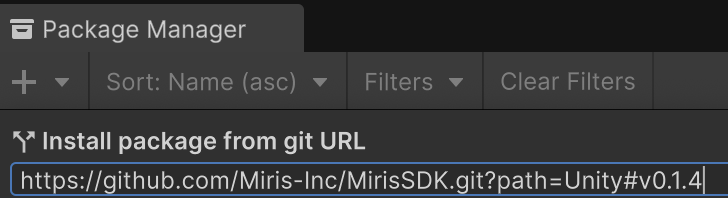
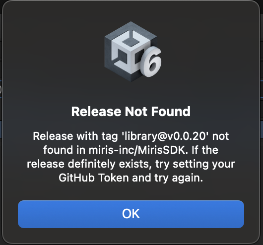
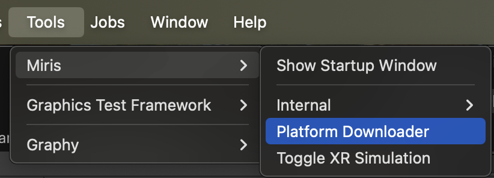
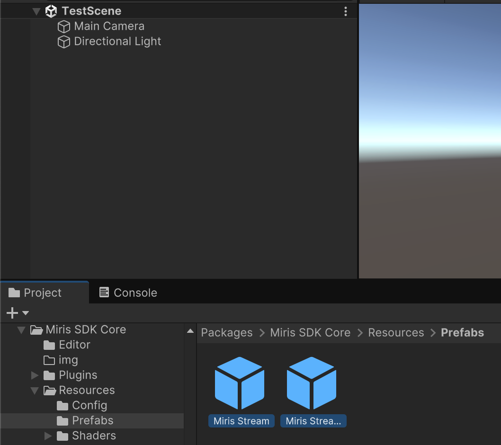
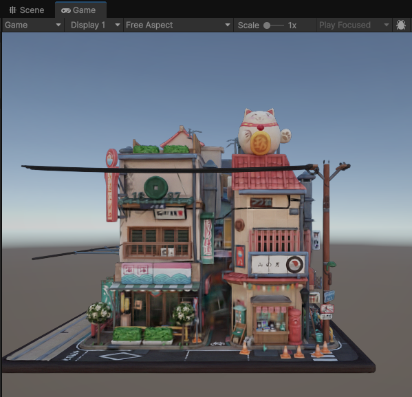

<!--MDX_STRIP-->
<!--Do not remove the MDX_STRIP comments - they are used for our Documentation publishing process-->
# Miris Unity Integration

Welcome to the Miris Unity Integration for spatial streaming.

## Requirements

<!--END_MDX_STRIP-->
Your Unity project must be using Unity 6000.0.58f2 or newer, with the built-in render pipeline.

Splats currently render on Apple platforms only. On other platforms, and in URP projects, the `Miris Stream Controller` logs an error and renders nothing.

For desktop hosts, the system requirements are below:

| OS      | Requirements                                                 |
| ------- | ------------------------------------------------------------ |
| macOS   | macOS 15.0                                                   |

For deployments targeting specific devices, the minimum system requirements are below:

| Device     | Requirements                                           |
| ---------- | ------------------------------------------------------ |
| iOS/iPadOS | iOS/iPadOS 18.2                                        |

## Installation

1. Make sure [git](https://git-scm.com/) is installed on your device.

2. Open a Unity Project and use the Package Manager to install the Miris SDK. **Please ensure that you are not in Play mode before proceeding with the following steps.**

    * Navigate to Window -> Package Manager
    
    * Use the "+" button to `Install git package from url...`
    
    * Paste the following into the git URL field to download the latest SDK, then click the install button: `https://github.com/Miris-Inc/MirisSDK.git?path=Unity#latest`
    

3. The Miris SDK will need to install the native libraries it uses into the `Assets/Plugins/Miris` folder. If this folder does not contain platform folders with libraries inside, you will need to download them via the in editor tool. 

    * If the `Assets/Plugins/Miris` folder already contains the libraries, you can skip to step 5.
    
    * If the folder does _not_ contain the libraries, or you see a pop-up like the above, you must follow the below instructions in step 4.

4. Miris Platform Downloader Editor Tool
    * In the Unity Editor window, in the toolbar, select Tools -> Miris -> Platform Downloader
      

    * If you've been directed to download a specific release, change the Tag field. Otherwise, simply click the Install button.

5. Prefab setup

    * Drop the Miris Stream and `Miris Stream Controller` prefab into your scene.
    
    * On the `Miris Stream` prefab, enter the ID for the asset you want to stream. This ID will have been supplied to you by our asset upload service, and is of the form `aaaaaaaa-bbbb-cccc-dddd-eeeeeeeeeeee`.

6. Stream!

    * If everything is set up successfully, the streaming content will be visible in the editor window without being in play mode. 
    * You can also press play to start streaming.
    

## Upgrading

### 0.1.0

`MirisStream.Status` has been removed. `MirisStream.GetStatus()` now returns `StreamStatus` (`Unknown`, `Resolving`, `Loading`, `Ready`, `Failed`), which reports the native stream's progress as of the controller's last scene sync. Replace checks against the old enum as follows:

| Before | After |
| ------ | ----- |
| `MirisStream.Status.Rendered`, to wait for data to arrive | `GetStatus() == StreamStatus.Ready` |
| `MirisStream.Status.Rendered`, to check the stream is drawing | `IsRendered()` (`false` while `Opacity` is 0) |
| `MirisStream.Status.Streaming` | `GetStatus()` is `Resolving` or `Loading` |
| `MirisStream.Status.NotLoaded` | `!IsLoaded()` |
| `MirisStream.Status.Disabled` | `!isActiveAndEnabled` |
| `MirisStream.Status.NoAssetId` | `string.IsNullOrEmpty(m_assetId)` |
| `MirisStream.Status.NoController` | `m_streamController == null` |
| `MirisStream.Status.ControllerInactive` | `!m_streamController.IsActive()` |
| `MirisStream.Status.NoData` | No equivalent |

`StreamStatus.Failed` is new: the stream could not be resolved or loaded.

<!--MDX_STRIP-->
### Notes

* Miris employees should consult the centralized documentation, rather than this document.
<!--END_MDX_STRIP-->
